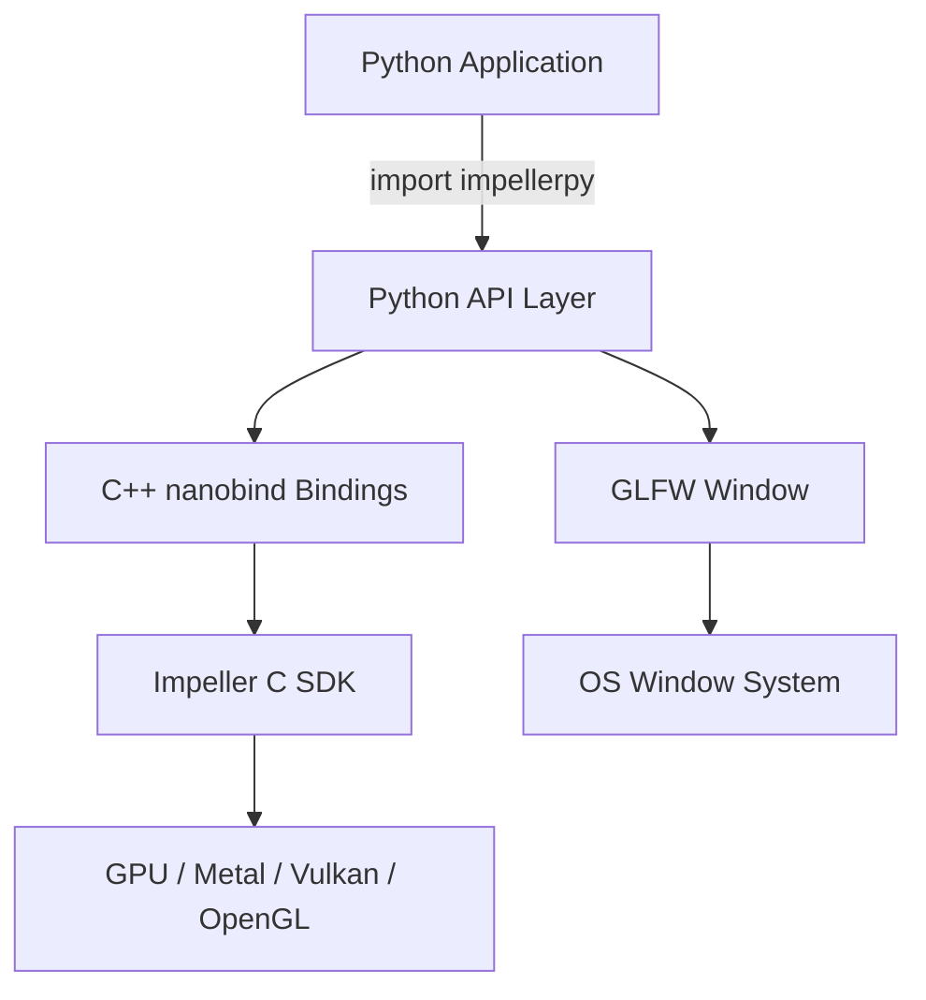
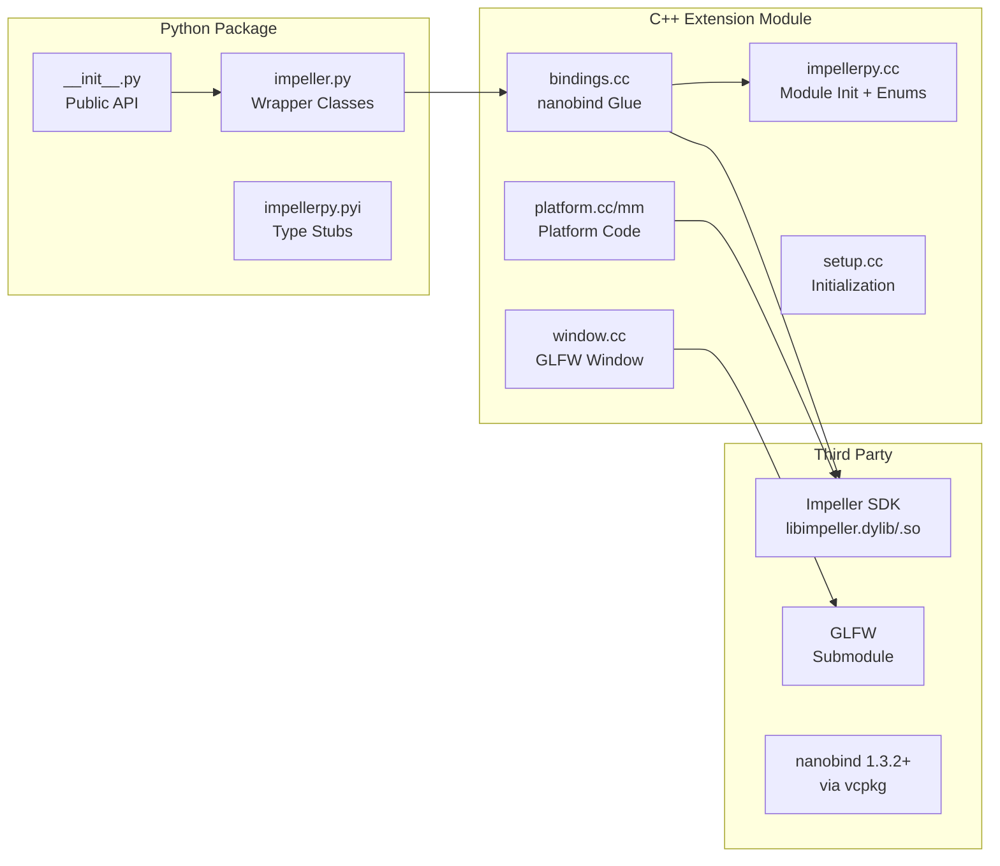
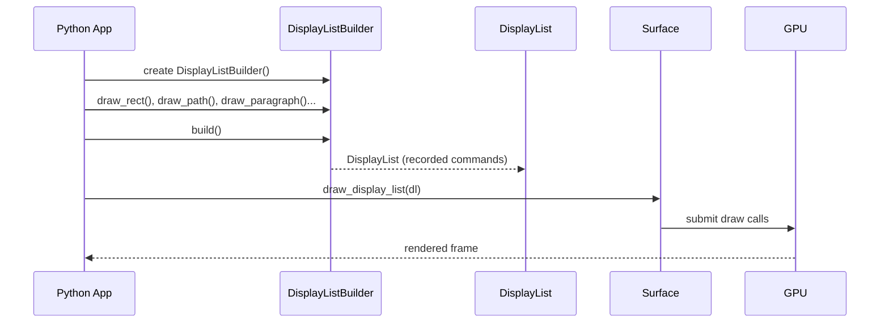
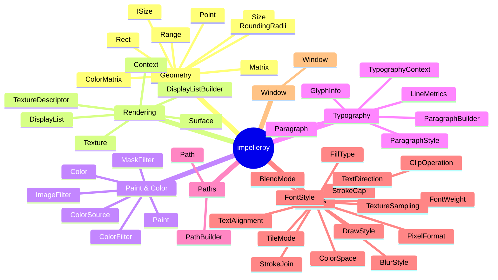

# ImpellerPy

Python bindings to [Impeller](https://github.com/flutter/flutter/blob/main/engine/src/flutter/impeller/README.md), [Flutter's](https://flutter.dev/) GPU-accelerated 2D rendering engine. ImpellerPy lets Python developers create high-performance graphics applications — with windows, vector paths, gradients, image filters, and rich typography — without requiring Flutter or Dart.

> **Status**: Early development (v0.1.2)

---

## Overview



ImpellerPy is structured in three layers:

| Layer | Language | Role |
|---|---|---|
| **Python API** (`src/impellerpy/`) | Python | Pythonic wrappers, method chaining, type stubs |
| **C++ Bindings** (`src/*.cc`) | C++ | nanobind bridge between Python and Impeller |
| **Impeller SDK** | C/C++ | Flutter's rendering engine (downloaded automatically at build time) |

---

## Architecture



---

## Features

- **Vector Graphics** — paths, rectangles, ovals, rounded rects, lines, polygons
- **Paint & Styling** — fill/stroke, blend modes, stroke caps and joins, dash patterns
- **Color Sources** — solid colors, linear gradients, conical (radial) gradients, sweep gradients, image sources
- **Image Filters** — blur, dilate, erode, matrix, compose
- **Color Filters** — blend, matrix, color space conversion
- **Mask Filters** — blur masks for soft shadows and glow
- **Textures** — import images, control sampling and tiling
- **Typography** — paragraph layout, font weight/style, text alignment, direction, line metrics, glyph info
- **Windowing** — create GPU-backed windows via GLFW with an event loop

---

## Rendering Pipeline



---

## Public API

The library exports 44 symbols organized by category:



---

## Usage

### Install from PyPI

```sh
pip install impellerpy
# or
uv add impellerpy
```

### Basic Drawing

```python
from impellerpy import (
    Context, Window, DisplayListBuilder,
    Paint, Color, Rect, BlendMode
)

ctx = Context()
window = Window()

paint = (
    Paint()
    .set_color(Color(r=0.2, g=0.6, b=1.0, a=1.0))
    .set_blend_mode(BlendMode.SOURCE_OVER)
    .set_stroke_width(3.0)
)

dl = (
    DisplayListBuilder()
    .draw_rect(Rect(100, 100, 300, 200), paint)
    .draw_oval(Rect(400, 150, 100, 100), Paint().set_color(Color(r=1, g=0.4, a=1)))
    .build()
)

surface = window.create_render_surface(ctx)
surface.draw(dl)
surface.present()
```

### Window with Event Loop

```python
from impellerpy import Context, Window, DisplayListBuilder, Paint, Color, Rect

ctx = Context()
window = Window()

while not window.should_close():
    surface = window.create_render_surface(ctx)
    dl = (
        DisplayListBuilder()
        .draw_rect(Rect(50, 50, 200, 200), Paint().set_color(Color(r=1, a=1)))
        .build()
    )
    surface.draw(dl)
    surface.present()
    window.poll_events()
```

### Gradients

```python
from impellerpy import Paint, ColorSource, Color, Point, TileMode

gradient = ColorSource.linear_gradient(
    start_point=Point(0, 0),
    end_point=Point(200, 0),
    colors=[Color(r=1, a=1), Color(b=1, a=1)],
    stops=[0.0, 1.0],
    tile_mode=TileMode.CLAMP,
)
paint = Paint().set_color_source(gradient)
```

### Typography

```python
from impellerpy import (
    TypographyContext, ParagraphBuilder, ParagraphStyle, FontWeight,
    DisplayListBuilder, Point
)

typo_ctx = TypographyContext()
style = ParagraphStyle().set_font_size(32).set_font_weight(FontWeight.W700)
para = (
    ParagraphBuilder(typo_ctx)
    .push_style(style)
    .add_text("Hello, Impeller!")
    .build(400)
)
dl = DisplayListBuilder().draw_paragraph(para, Point(50, 50)).build()
```

---

## Prerequisites

- A C11 and C++20 compiler
- CMake 3.22 or above
- Git
- Ninja
- [vcpkg](https://vcpkg.io/en/index.html) — set the `VCPKG_ROOT` environment variable

vcpkg compiles CPython 3 from source. Install the required tools first:

**macOS:**
```sh
brew install autoconf automake autoconf-archive
```

**Linux:**
```sh
sudo apt-get install -y autoconf automake autoconf-archive \
  libx11-dev libxrandr-dev libxinerama-dev libxi-dev libxcursor-dev \
  mesa-libGL-devel wayland-devel libxkbcommon-devel libudev-devel
```

---

## Building from Source

> [!IMPORTANT]
> The first build will take a while — vcpkg compiles all C++ dependencies from source. Results are cached for subsequent builds.

```sh
# Clone with submodules
git clone --recurse-submodules https://github.com/chinmaygarde/impellerpy
cd impellerpy

# Fetch/update submodules
just sync

# Build
just

# Run tests
just test

# Format and lint
just format
just check
```

### Build Targets

| Command | Description |
|---|---|
| `just` | Build the extension module |
| `just sync` | Fetch all git submodules |
| `just test` | Run the pytest test suite |
| `just clean` | Remove build artifacts |
| `just format` | Format Python code with Ruff |
| `just check` | Lint Python code with Ruff |
| `just package` | Build a distributable wheel |
| `just serve-docs` | Serve documentation locally |
| `just deploy-docs` | Deploy documentation to GitHub Pages |

---

## Project Structure

```
impellerpy/
├── src/
│   ├── impellerpy/          # Python package
│   │   ├── __init__.py      # Public exports (44 symbols)
│   │   ├── impeller.py      # Pythonic wrapper classes
│   │   └── impellerpy.pyi   # Type stubs
│   ├── bindings.cc/h        # nanobind Python↔C++ bridge
│   ├── impellerpy.cc        # Module init, enum bindings
│   ├── window.cc/h          # GLFW window management
│   ├── platform.cc/h/mm     # Platform-specific code
│   └── setup.cc/h           # Library initialization
├── tests/                   # 15 pytest test files
├── docs/                    # MkDocs documentation source
├── third_party/
│   ├── glfw/                # Submodule: window library
│   └── cmake_toolbox/       # Submodule: CMake utilities
├── assets/                  # Test assets
├── CMakeLists.txt
├── pyproject.toml
└── justfile
```

---

## Platform Support

| Platform | Architecture | Status |
|---|---|---|
| macOS | Apple Silicon (arm64) | Supported |
| macOS | Intel (x64) | Supported |
| Linux | x64 | Supported |
| Windows | x64 | In progress |

---

## Development Dependencies

```toml
[dependency-groups.dev]
cibuildwheel   # Cross-platform wheel building
pytest         # Test framework
pillow         # Image I/O for tests
pyglm          # GLM math types for tests
ruff           # Linting and formatting
mkdocs         # Documentation
mkdocstrings   # Auto-generate API docs from docstrings
twine          # PyPI upload
```

---

## License

MIT
